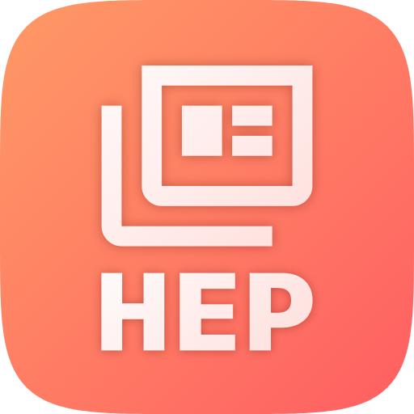

# Heplio

Unofficial INSPIRE-HEP client for iOS/iPadOS.

~~App Store~~ | ~~TestFlight~~ (coming soon)

Heplio is an unofficial INSPIRE-HEP client for iPhone and iPad, designed for researchers and students in high-energy physics.

## Features

- **Search** — full-text search across INSPIRE-HEP's literature database, sortable by relevance, date, or citations
- **New** — a time-ordered feed of recent papers, grouped by day and filterable by arXiv category
- **Explore** — a static browsable catalog: arXiv categories, collaborations, and curated collections (reviews, lecture notes, landmark papers)
- **Home** — personalized recommendations based on your saved papers and reading history
- **Library & History** — save papers offline, and revisit your reading and search history
- Paper detail screens with references, citations, related papers, figures, LaTeX/MathML rendering, and links to arXiv/DOI/PDF

## Requirements

- iPadOS or iOS 26 or later
- Swift Playgrounds (iPad) to build and run, or Xcode 26+ (untested — see [Build](#build))

## Build

### Swift Playgrounds on iPad

Requires iPadOS 26 or later. Clone this repository as `HeplioApp.swiftpm`, open it in Swift Playgrounds, and tap Run to build and launch on the device.

### Xcode, etc.

This is a standard `.swiftpm` App Project, so it should also open and build in Xcode 26+ on macOS — untested, since the maintainer has no Mac to verify it on.

## License

The source code is MIT licensed — see [LICENSE](LICENSE).

This license covers the app's code only. Paper metadata, abstracts, figures, and PDFs are fetched live from the INSPIRE-HEP API and remain subject to INSPIRE-HEP's own terms of use and the copyright of the original authors and publishers. Heplio is not affiliated with or endorsed by INSPIRE-HEP or CERN.

## Acknowledgments

- [INSPIRE-HEP](https://inspirehep.net) — the literature database this app is a client for
- [KaTeX](https://katex.org) and [MathJax](https://www.mathjax.org) — loaded from CDN at runtime to typeset LaTeX and MathML in titles and abstracts
